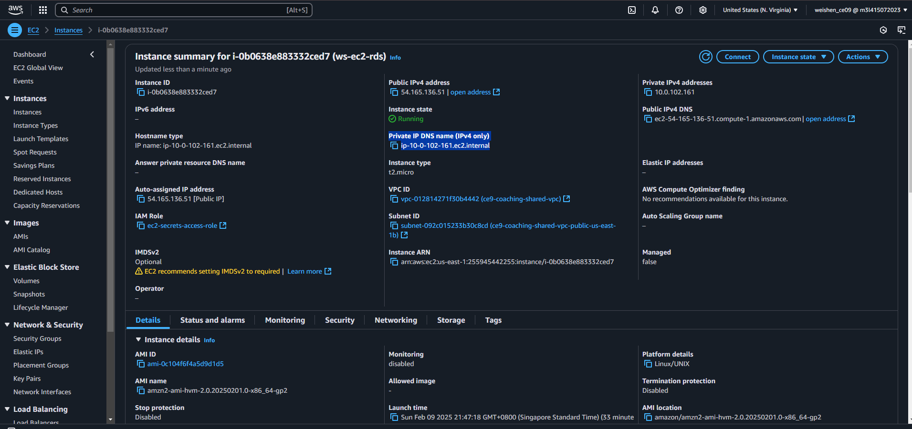

# EC2-RDS-IAM
EC2 is to be in a public subnet with the network connectivity to access RDS. Use AWS CLI to fetch the database credentials from AWS Secrets Manager, use it in the EC2 to connect to RDS databsee instance.

# Architecture Overview
EC2 instance in a Public Subnet: This instance will have internet access and connect to the RDS database.
RDS in a Private Subnet: The database will not be accessible from the internet, enhancing security.

# Prerequisition
A VPC is created, where ce9-coaching-shared-vpc is used.

# EC2

# RDS endpoint

# SSH into the EC2 instance and use a database client (MySQL, psql, etc.) to test the connection
Code:
mysql -h terraform-20250209095654857700000001.chheppac9ozc.us-east-1.rds.amazonaws.com -u admin -p

# Check the logs to verify if it connected to RDS
code:
cat /home/ec2-user/db.log
Expected outcome:

